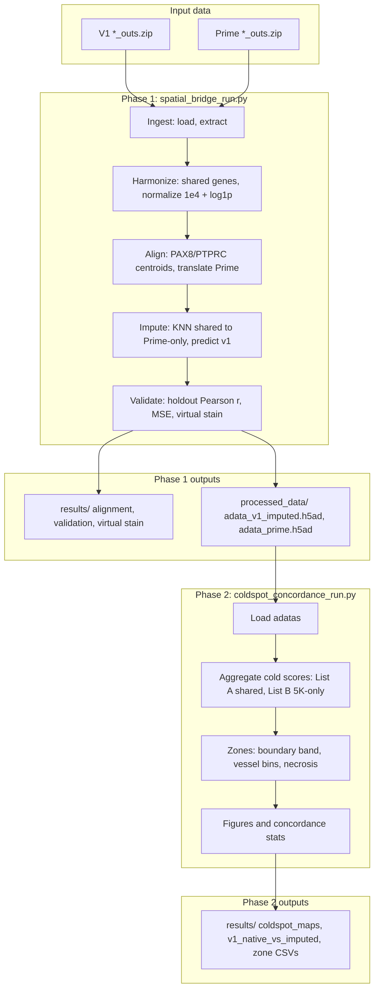
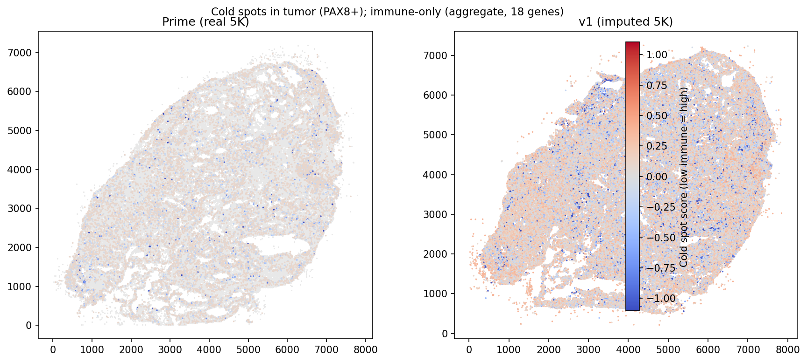
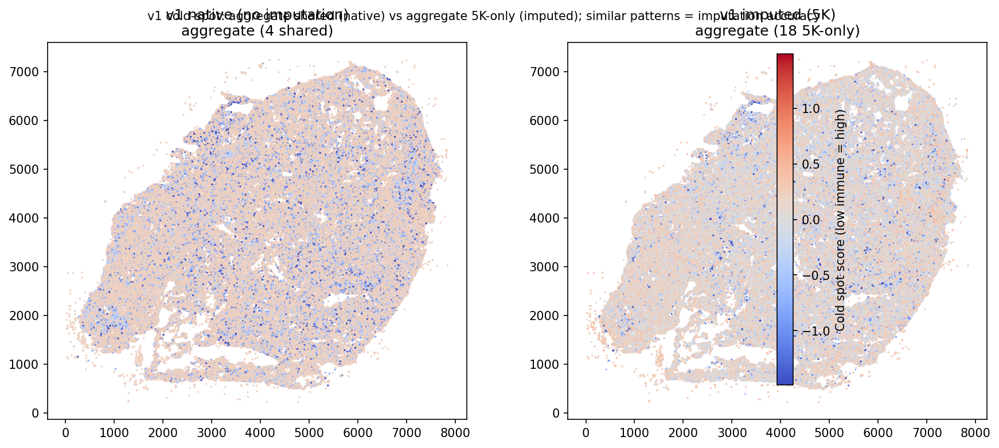

# SpatialBridge

**SpatialBridge** upsamples 10x Xenium v1 (477-gene) expression to a Prime 5K–like panel using an adjacent Xenium Prime 5K section. Spatial registration (PAX8/PTPRC anchor alignment), KNN-based gene imputation, and validation. Optional **cold-spot concordance** compares immune cold-spot geography between native v1, imputed v1, and Prime.

---

## Quick start

```bash
git clone <repository-url>
cd clean_repo_xenium
pip install -r requirements.txt
```

Place Xenium output bundles in `data/`:

- `Xenium_V1_Human_Ovary_Cancer_FF_outs.zip` (v1)
- `Xenium_Prime_Human_Ovary_Cancer_FF_outs.zip` (Prime 5K)

For other datasets, edit `src/config.py` (paths). See [docs/About_the_data.md](docs/About_the_data.md) for the example dataset.

**Run the pipeline:**

```bash
# Phase 1: full pipeline (or use --small for a quick test)
python spatial_bridge_run.py

# Phase 2: cold-spot concordance (run after Phase 1)
python scripts/coldspot_concordance_run.py
```

**Outputs:** `results/` (plots, CSVs, interpretation), `processed_data/` (h5ad files).

**Quick test (no data):** `python tests/test_pipeline_synthetic.py`

---

## Pipeline orchestration



---

## Representative results (cold-spot concordance)

After running the pipeline, the cold-spot step produces side-by-side maps comparing:

1. **Prime (real 5K) vs v1 (imputed 5K)** — Cold-spot geography in tumor (PAX8+) cells; aggregate immune score.
2. **v1 native vs v1 imputed** — Improvement from imputation: native v1 (shared genes only) vs v1 with 5K imputed genes.

| Prime vs v1 imputed | v1 native vs v1 imputed |
|---------------------|-------------------------|
|  |  |

*Copy the PNGs from `results/` to `docs/figures/` after running the pipeline (see `docs/figures/.gitkeep`).*

---

## Citation

If you use this software in your research, please cite the repository and any associated publication.

---

## Overview

SpatialBridge addresses the need to expand gene coverage when using Xenium v1 (477 genes) alongside adjacent Prime 5K sections (~5000 genes). By spatially registering the two sections and imputing Prime-only genes into v1 space via KNN, the pipeline enables downstream analysis (e.g. cold-spot mapping, immuno-oncology markers) in v1 coordinates with 5K-style panel coverage. Cold-spot concordance evaluates how well imputed data recapitulates immune geography compared with ground-truth Prime.

---

## Requirements

- Python 3.10+
- See `requirements.txt` (anndata, scanpy, squidpy, spatialdata, spatialdata-io, scikit-learn, matplotlib, etc.)

---

## Installation

See [docs/INSTALL.md](docs/INSTALL.md) for detailed install and environment setup.

---

## Data

Place Xenium output bundles in `data/`:

- `Xenium_V1_Human_Ovary_Cancer_FF_outs.zip` (v1)
- `Xenium_Prime_Human_Ovary_Cancer_FF_outs.zip` (Prime 5K)

The pipeline extracts zips into `data/v1_outs` and `data/prime_outs` if not already present. For other datasets, edit `src/config.py` (`V1_BUNDLE`, `PRIME_BUNDLE`, `V1_EXTRACTED`, `PRIME_EXTRACTED`).

---

## Usage

### Phase 1: Main pipeline

```bash
python spatial_bridge_run.py
```

Optional flags: `--small` (subset for testing), `--n-cells`, `--n-shared`, `--n-prime-only`, `--out-dir`, `--log`. Plots go to `--out-dir` (default: `results/`); large h5ad files go to `processed_data/` (config).

### Phase 2: Cold-spot concordance

```bash
python scripts/coldspot_concordance_run.py
```

Requires `processed_data/adata_v1_imputed.h5ad` and `processed_data/adata_prime.h5ad` from Phase 1.

### Load and verify (optional)

```bash
python scripts/load_and_verify.py
```

Verifies data load and spatial access without running the full pipeline.

---

## Outputs

| Output | Location |
|--------|----------|
| alignment_check.png | results/ |
| validation_scatter.png | results/ |
| virtual_stain_2x2.png | results/ |
| results_summary.txt | results/ |
| coldspot_maps_sidebyside.png | results/ |
| coldspot_v1_native_vs_imputed_sidebyside.png | results/ |
| coldspot_by_context_sidebyside.png | results/ |
| coldspot_concordance_scatter.png | results/ |
| coldspot_feature_*.png, coldspot_zone_means.csv, coldspot_interpretation.txt | results/ |
| adata_v1_imputed.h5ad, adata_prime.h5ad | processed_data/ |

---

## Project structure

| Path | Role |
|------|------|
| `spatial_bridge_run.py` | Phase 1 entry point |
| `scripts/coldspot_concordance_run.py` | Phase 2 entry point |
| `scripts/load_and_verify.py` | Data verification utility |
| `src/config.py` | Paths and parameters |
| `src/ingest.py`, `alignment.py`, `inference.py`, `validation.py` | Pipeline modules |
| `src/coldspot_concordance.py`, `discovery.py` | Cold-spot analysis |
| `src/spatial_data.py`, `load_xenium.py` | Data loading API |
| `docs/PROJECT_WORKFLOW.md` | Complete workflow and resurrection guide |
| `docs/INSTALL.md` | Installation details |
| `docs/About_the_data.md` | Example dataset description |
| `METHODS_NOTES.md` | Manuscript methods text |

---

## Methods

Brief pipeline: Ingest v1 and Prime; identify shared genes; normalize (1e4, log1p); align via PAX8/PTPRC centroids; impute Prime-only genes with KNN (k=15, distance-weighted); validate via holdout shared genes (Pearson r, MSE). Cold-spot: aggregate immune-only scores (two gene lists), spatial zones (boundary, vessel bins, necrosis), zone-level concordance. See `METHODS_NOTES.md` and `docs/PROJECT_WORKFLOW.md` for details.

---

## Testing

```bash
python tests/test_pipeline_synthetic.py
```

No Xenium data required; uses synthetic AnnData.

---

## License

See [LICENSE](LICENSE). Example data (10x Genomics) are under CC BY 4.0.

---

## Acknowledgments

Example datasets from 10x Genomics (CC BY 4.0). See `docs/About_the_data.md` for full attribution.
